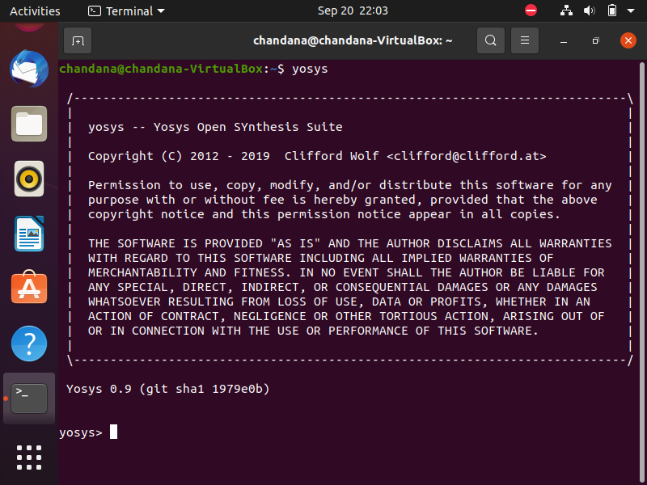
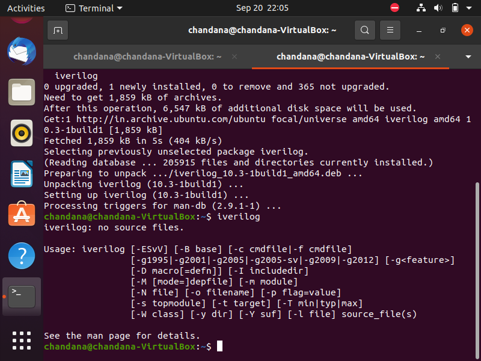
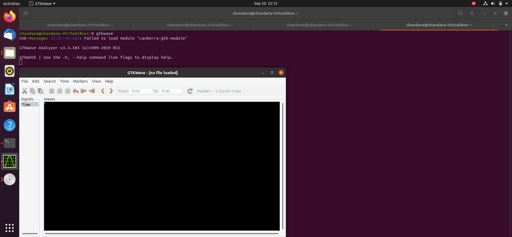
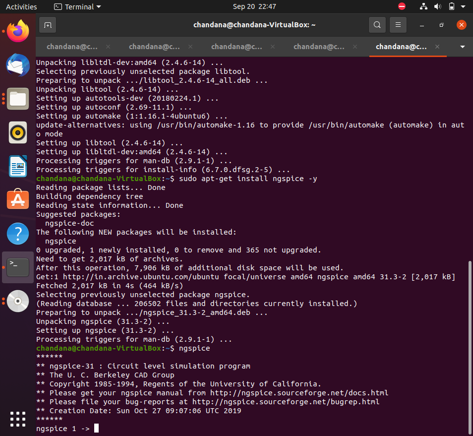
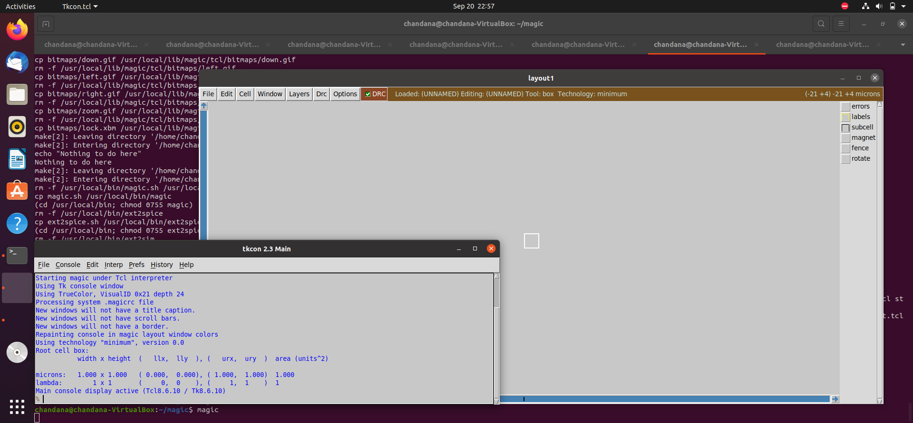
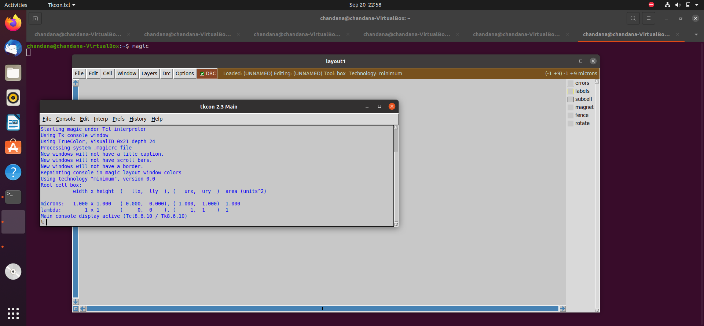
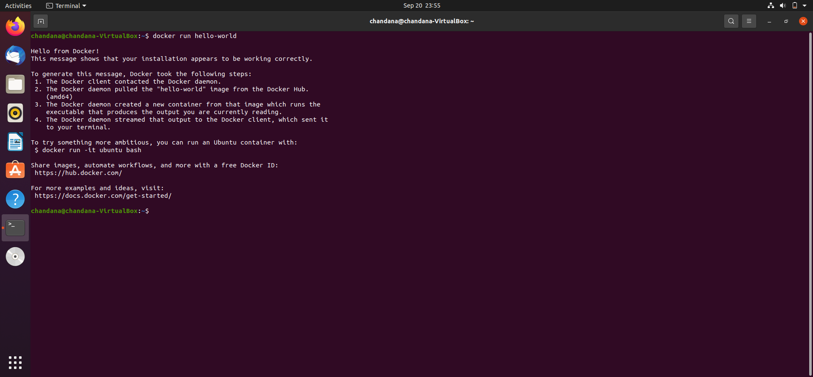
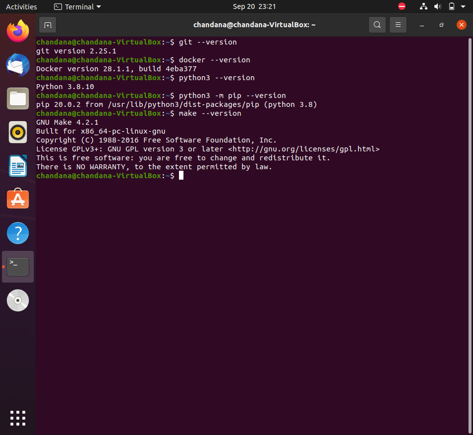

# 📅 Week 0 — Setup & Tools

## 📌 Task 1: Create GitHub Repo & Document Summary
- Repository created: **RISC-V_SOC_Tapeout**
- Purpose: To track and document my progress in the **RISC-V SoC Tapeout Program (VSD)**.
- This repo will have **week-wise folders** (Week0, Week1, …) with tasks, notes, and proofs.
- Week 0 focuses on **environment setup and EDA tool installation**.

## 📌 Task 2: Install Tools in Ubuntu VM
According to the program guidelines, I prepared the following setup:

### 🖥️ System Setup
- Virtual Machine: Oracle VirtualBox  
- OS: Ubuntu 20.04 LTS (Desktop, 64-bit)  
- Configuration:  
  - **RAM:** 6 GB  
  - **Disk:** 50 GB  
  - **CPU:** 4 vCPUs  

### 🛠️ Tools to Install
- **Yosys** → RTL Synthesis & Logic Optimization  
- **Icarus Verilog (iverilog)** → Verilog Simulation  
- **GTKWave** → Waveform Viewer  
- **Ngspice** → Circuit Simulation  
- **Magic** → Layout Design & DRC  
- **OpenLane** → End-to-End Physical Design Flow  

---

## 📸 Installation Snapshots
Below are screenshots for tool installation verification.

- Yosys →   
- Icarus Verilog →   
- GTKWave →   
- Ngspice →   
- Magic →   
- Magic (additional) → 
- OpenLane → 
- Tools Version →   

---

## ✅ Status
- Repository created: ✔️  
- VM setup completed: ✔️  
- Tool installation: ✔️ (screenshots added for Yosys, iVerilog, GTKWave, Ngspice, Magic, OpenLane)  
- README updated with verified snapshots: ✔️

---

## 🙏 Acknowledgment
Thanks to **VSD (VLSI System Design)** for organizing the RISC-V SoC Tapeout Program and providing open-source learning opportunities.
